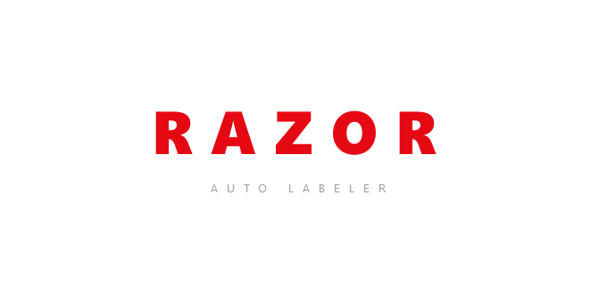

# RAZOR Auto Labeler

<p align="center">
  
</p>

<h1 align="center">RAZOR Auto Labeler</h1>

<p align="center">
  <strong>Automatic image labeling powered by YOLO object detection</strong>
</p>

<p align="center">
  <a href="https://github.com/RAZ0R-X/razor-labeler/releases/latest">
    
  </a>
  
  
  
</p>

<p align="center">
  <a href="#screenshots">Screenshots</a> •
  <a href="#download">Download</a> •
  <a href="#features">Features</a> •
  <a href="#installation">Installation</a> •
  <a href="#usage">Usage</a> •
  <a href="#export-formats">Export Formats</a>
</p>

---

RAZOR Auto Labeler is a desktop application that loads a trained YOLO model and automatically labels thousands of images in one click. With Roboflow-compatible export formats, you can move your annotations straight into any training pipeline.

---

## Screenshots

<p align="center">
  
</p>

<p align="center">
  <em>Splash screen with RAZOR branding</em>
</p>

<p align="center">
  
</p>

<p align="center">
  <em>Main window — load a model, select classes, pick images, and auto-label</em>
</p>

<p align="center">
  
</p>

<p align="center">
  <em>Class selector — rename, filter, and enable/disable export classes</em>
</p>

---

## Download

### Windows Installer (Recommended)

Download the latest setup file from [**Releases**](https://github.com/RAZ0R-X/razor-labeler/releases/latest):

| File | Description |
|------|-------------|
| `RAZOR-AutoLabeler-Setup-v1.0.0.exe` | Full Windows installer — creates Start Menu shortcut, optional desktop icon |

> No Python installation required. Just run the installer and launch **RAZOR Auto Labeler** from the Start Menu.

### Portable Build

| File | Description |
|------|-------------|
| `RAZOR-AutoLabeler-v1.0.0-portable.zip` | Extract and run `RAZOR-AutoLabeler.exe` directly |

---

## Features

| Feature | Description |
|---------|-------------|
| **YOLO model support** | `.pt`, `.onnx`, `.engine`, `.torchscript`, `.xml`, `.tflite` |
| **Open-vocabulary models** | YOLO-World with custom class names |
| **Batch processing** | Load a folder or multiple images, label in the background |
| **Class management** | Rename, filter, and disable model classes for export |
| **Confidence threshold** | Adjustable from 0.05 to 1.0 |
| **20+ export formats** | YOLOv8/v9/v11/v12, COCO, Pascal VOC, CSV, and more |
| **Preview images** | Annotated images with bounding boxes saved alongside labels |
| **Modern UI** | PyQt6 dark theme with RAZOR branding |

---

## Installation

### Option 1 — Windows Setup (Easiest)

1. Download `RAZOR-AutoLabeler-Setup-v1.0.0.exe` from [Releases](https://github.com/RAZ0R-X/razor-labeler/releases/latest)
2. Run the installer and follow the wizard
3. Launch **RAZOR Auto Labeler** from the Start Menu

### Option 2 — Run from Source

**Requirements:** Python 3.10+, Windows 10/11 (Linux/macOS supported via `python main.py`)

```bash
git clone https://github.com/RAZ0R-X/razor-labeler.git
cd razor-labeler
python -m venv .venv
```

**Windows (PowerShell):**
```powershell
.\.venv\Scripts\Activate.ps1
pip install -r requirements.txt
python main.py
```

**Linux / macOS:**
```bash
source .venv/bin/activate
pip install -r requirements.txt
python main.py
```

> On first run, Ultralytics may download PyTorch automatically. This can take a few minutes.

---

## Usage

1. **Load Model** — Select your trained YOLO model (`.pt` recommended)
2. **Edit Classes** — Choose which classes to export, rename them if needed
3. **Load Images** or **Load Folder** — Add images to label
4. **FORMAT** — Pick the output format (default: YOLOv11)
5. **CONFIDENCE** — Set the minimum confidence threshold
6. **Auto Label** — Start labeling and choose an output folder

### Output structure

```
output/
├── labels/          # Annotation files in the selected format
├── images/          # Preview images with bounding boxes
├── data.yaml        # Class definitions for YOLO training
└── classes.txt      # Class name list
```

### Supported image formats

`.jpg`, `.jpeg`, `.png`, `.bmp`, `.webp`, `.tif`, `.tiff`

---

## Export Formats

| Group | Formats |
|-------|---------|
| **TXT (YOLO)** | YOLO Darknet, YOLOv5/v7/v8/v9/v11/v12, YOLO26, OBB, CSV |
| **JSON** | COCO, COCO-MMDetection, CreateML, PaliGemma, Florence 2, OpenAI |
| **XML** | Pascal VOC |

Default format: **YOLOv11**

---

## Project Structure

```
razor-labeler/
├── main.py                 # Application entry point
├── requirements.txt        # Python dependencies
├── assets/                 # Logo and icons
├── docs/screenshots/       # README screenshots
├── installer/              # Inno Setup installer script
├── build/                  # PyInstaller spec
└── src/
    ├── main_window.py      # Main UI
    ├── model_manager.py    # YOLO inference
    ├── worker.py           # Background labeling thread
    ├── label_exporter.py   # Multi-format export
    └── ...
```

---

## Building from Source (Developers)

```powershell
# Install dependencies
pip install -r requirements.txt -r requirements-build.txt

# Generate icon
python scripts/build_logo_ico.py

# Build EXE + installer
.\scripts\build_release.ps1
```

Output:
- `dist/RAZOR-AutoLabeler/` — portable folder
- `dist/RAZOR-AutoLabeler-Setup-v1.0.0.exe` — Windows installer

---

## Troubleshooting

| Issue | Solution |
|-------|----------|
| `ModuleNotFoundError` | Activate the virtual environment and run `pip install -r requirements.txt` |
| Model won't load | Check that the file extension is supported (`.pt`, `.onnx`, etc.) |
| Slow labeling | Install CUDA-enabled PyTorch for GPU acceleration |
| Empty label files | Lower the confidence threshold or review class filters |

---

## License

This project is licensed under the [MIT License](LICENSE).

---

## Author

**Cihan Cinoğlu**

---

## Changelog

### v1.0.0 (2026-07-23)

- Initial stable release
- YOLO-based automatic labeling
- 20+ export format support
- YOLO-World open-vocabulary support
- PyQt6 modern UI
- Windows installer (Setup.exe)
