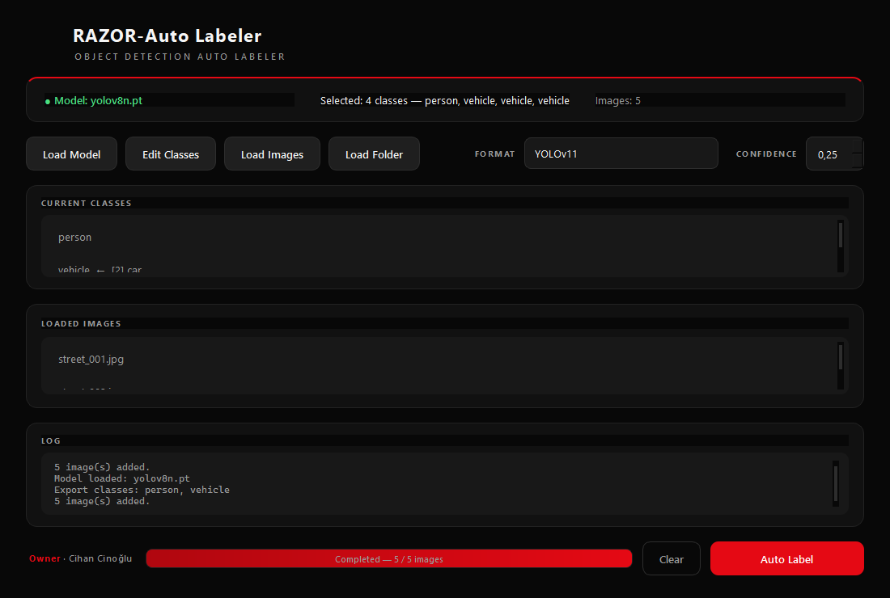
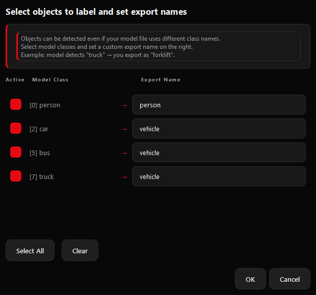

# RAZOR Auto Labeler

<p align="center">
  
</p>

<p align="center">
  <strong>Automatic image annotation for YOLO models.</strong>
</p>

<p align="center">
  <a href="https://github.com/RAZ0R-X/razor-auto_labeler/releases/latest">
    
  </a>
  
  
  
</p>

<p align="center">
  <a href="#features">Features</a> •
  <a href="#screenshots">Screenshots</a> •
  <a href="#installation">Installation</a> •
  <a href="#supported-formats">Supported Formats</a> •
  <a href="#license">License</a>
</p>

---

RAZOR Auto Labeler is a Windows desktop application that automatically creates image annotations using YOLO object detection models.

Load a model, select your images, choose an export format, and generate training datasets in just a few clicks. The application supports both standard YOLO models and YOLO-World, making it suitable for dataset creation, model evaluation, and computer vision projects.

---

# Features

- Automatic image annotation
- Support for YOLO `.pt`, `.onnx`, `.engine`, `.xml`, `.tflite` and other supported model formats
- YOLO-World open-vocabulary support
- Batch processing for folders and image collections
- Class filtering and renaming
- Adjustable confidence threshold
- Preview images with bounding boxes
- Export to more than 20 annotation formats
- Clean and responsive PyQt6 interface

---

# Screenshots

<p align="center">
  
</p>

<p align="center">
  
</p>

---

# Installation

### Windows

1. Download the latest installer from the **Releases** page.
2. Run **RAZOR-AutoLabeler-Setup.exe**.
3. Launch the application.

No Python installation is required.

### Build from source

```bash
git clone https://github.com/RAZ0R-X/razor-auto_labeler.git
cd razor-auto_labeler

python -m venv .venv

# Windows
.venv\Scripts\activate

# Linux / macOS
source .venv/bin/activate

pip install -r requirements.txt
python main.py
```

---

# Supported Formats

### YOLO

- YOLO Darknet
- YOLOv5
- YOLOv8
- YOLOv9
- YOLOv11
- YOLOv12
- YOLO OBB

### Other Formats

- COCO
- Pascal VOC
- CSV
- CreateML
- Florence 2
- PaliGemma
- OpenAI

...and many more.

---

# License

This project is licensed under the MIT License.

---

# Author

**Cihan Cinoğlu**
